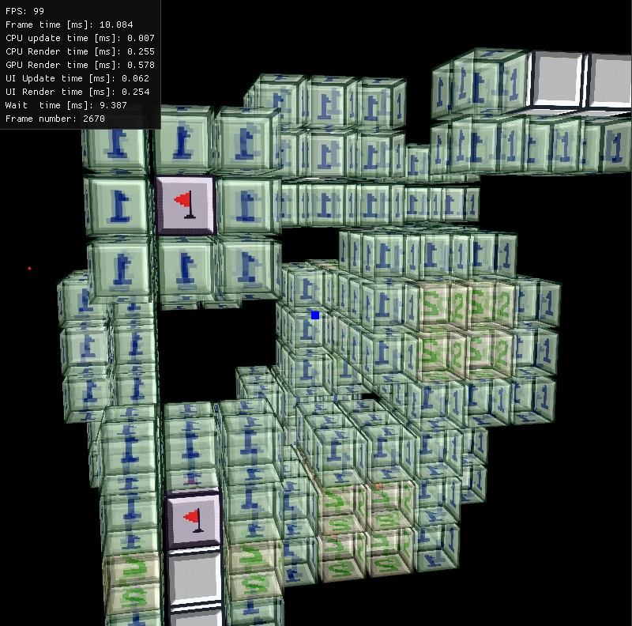
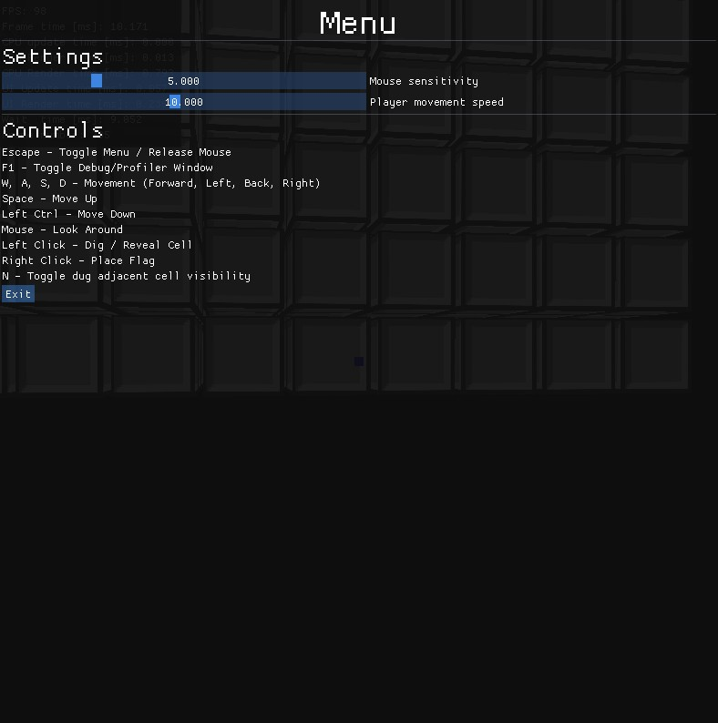

# Minesweeper 3D

3D implementation of a classic minesweeper game, built from the ground up using C++23, and OpenGL.
A fresh take on the classic game logic, reimagined through unique 3D spatial mechanics that add a new layer of depth and challenge.
> [!NOTE]
> This project is under active development and will definitely be improved as I have some free time.



## Key features

* **Unique gameplay** Third dimension allows for a completely new gameplay experience with a unique mechanic - **togglable semi-transparent walls** - an essential tool for navigating the 3D grid and clearing your way to victory.  
* **Custom template-based math library**: My own custom-made math library including linear algebra for 3D projections, collisions and more.
* **OpenGL**: Rendering system enabling high-performance.
* **C++23** Written using modern C++23 and following best practices
* **Real-time profiling** CPU/GPU real-time data for monitoring performance.

## Running

```bash
# Clone the repo
git clone https://github.com/oosiriiss/minesweeper3d
cd minesweeper3d
cmake -B build -G Ninja -DCMAKE_BUILD_TYPE=Release 

# Compile
cmake --build build 

# Ensure the assets directory is in the same directory as the executable
cp -r assets ./build/assets

# Run the executable
./build/minesweeper3d

# Controls are available after you press ESCAPE key in game.
```

# Technologies
* Language: C++23
* Graphics API: OpenGL 4.6 Core
* External Libraries:
    * [GLFW](https://github.com/glfw/glfw) - Window and input management.
    * GLAD - OpenGL loader
    * [Dear ImGui](https://github.com/ocornut/imgui): Immediate mode UI
    * [stb_image](https://github.com/nothings/stb/blob/master/stb_image.h) 
* My own libraries
    * [tasty](https://github.com/oosiriiss/tasty) - Testing library
    * [logzy](https://github.com/oosiriiss/logzy) - Logging utilities


## Other screenshots




